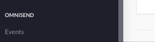
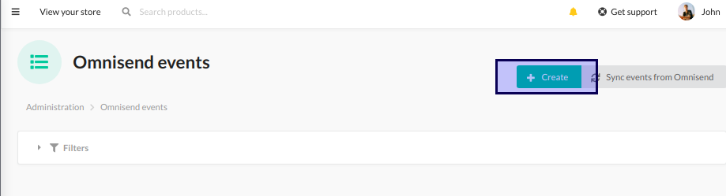
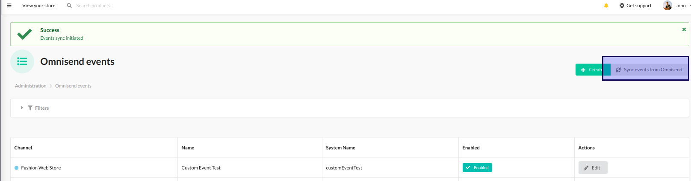

##Custom events

###Admin area
Custom events can by added in admin area:





Custome event should have system name and fields list.
Fields type should be selected from provided list:
```php
    public const TYPE_INT = 'int';
    public const TYPE_FLOAT = 'float';
    public const TYPE_BOOL = 'bool';
    public const TYPE_STRING = 'string';
    public const TYPE_EMAIL = 'email';
    public const TYPE_URL = 'url';
    public const TYPE_DATE = 'date';
    public const TYPE_DATETIME = 'dateTime';
```
###Dispatch custom event

To trigger a custom event you have to dispatch a Symfony event. Plugin will handle this message and will send it to Omnisend, if all fields are filled correctly.
Fields are validated by `CustomEventFields` constraint. 
```php
use NFQ\SyliusOmnisendPlugin\Event\CustomEvent;

    new CustomEvent(
        'email@nfq.lt', #email
        'testName', #system name
        'FASHION_WEB', #channel code
        [ #custom fields
            'integer' => 1,
            'bool' => true,
            'datetime' => "2010-12-12T12:12:12+00:00",
            'date' => "2019-02-10",
            'string' => "asdfasdfasd",
            'float' => 10.2,
            'email' => "email@email.lt",
            'url' => "http://asdasd.lt",
        ]
    )
```

###Sync custom event

Already created events can be synced with Omnisend in admin area. 


