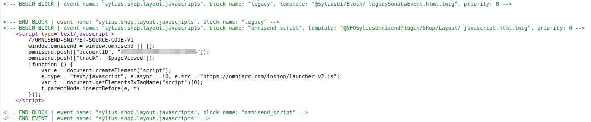

##Tracking
Omnisend tracking is implement if channel has omnisend account Id. This value can be applied in channel edit form:


Then account id is provided, in every product page Omnisend tracking script will be included:



###Product picker
In product page, product picker script will be displayed if channel has Omnisend account Id.


To debug product picker data add get parameter `?omnisendDebugConsole=1`in product page. For example:
```
http://localhost/en_US/products/666f-boyfriend-jeans-with-rips?omnisendDebugConsole=1
```
Product picker debug console will popup:


